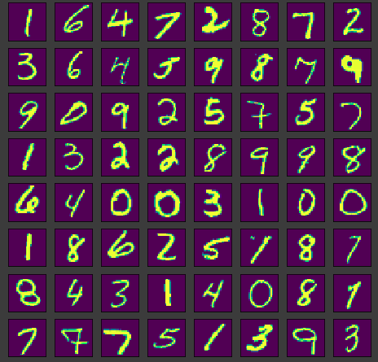
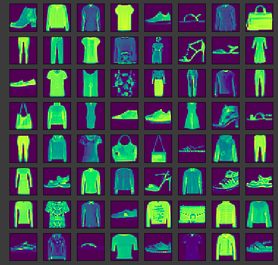
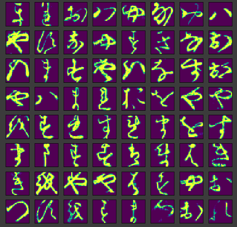
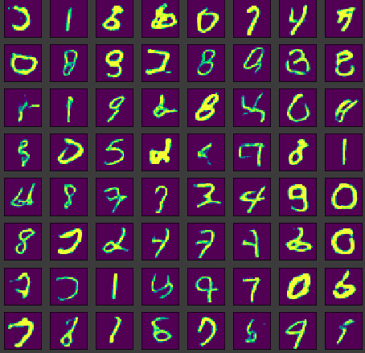
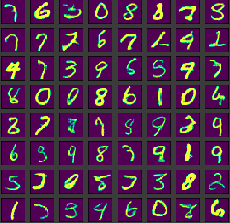
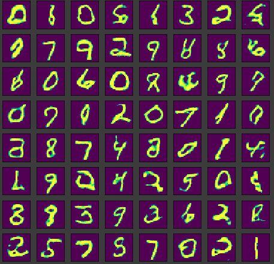
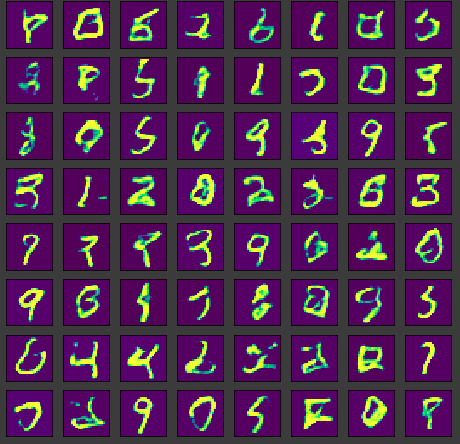

<!-- vscode-markdown-toc -->
* 1. [Setting up the project dependencies](#Settinguptheprojectdependencies)
* 2. [Running the code](#Runningthecode)
	* 2.1. [Using the jupyter notebook](#Usingthejupyternotebook)
	* 2.2. [Running the code using CLI](#RunningthecodeusingCLI)
* 3. [Results](#Results)
	* 3.1. [Train dataset samples](#Traindatasetsamples)
	* 3.2. [Generated Samples](#GeneratedSamples)
	* 3.3. [FID Score Comparison](#FIDScoreComparison)
	* 3.4. [Effect of Finetuning on sample quality](#EffectofFinetuningonsamplequality)
	* 3.5. [Effect of using Different activation functions](#EffectofusingDifferentactivationfunctions)
* 4. [Author](#Author)

<!-- vscode-markdown-toc-config
	numbering=true
	autoSave=true
	/vscode-markdown-toc-config -->
<!-- /vscode-markdown-toc -->

# Comparison of GAN Architectures

This repository contains code and results for comparing several GAN architectures.

# Diving into the code

##  1. Setting up the project dependencies

1) Install pipenv using the command `pip insalll pipenv`
2) Install the project dependencies by running the command `pipenv install` in the project directory which will set up the dependencies after creating a virtual env.

##  2. Running the code

###  2.1. Using the jupyter notebook

You can find the jupyter notebook for this project in `notebooks/project_gans.ipynb`. Running it should be fairly simple as the code is well-commented and explained fairly well.

###  2.2. Running the code using CLI

In the project directory use the following commands:

**For training**:
`cg train`

**For Generating samples**:
`cg generate_samples`

Use the command `cg --help` for an overview of what each command does

The file `config.yaml` stores the configuration of the classifier.

**Note**: To compute the FID scores, I used the following repo: https://github.com/mseitzer/pytorch-fid

##  3. Results

###  3.1. Train dataset samples

<table>
<tr>
<td>

MNIST dataset

</td>
<td>

Fashion-MNIST dataset

</td>
<td>

KMNIST dataset

</td>
</tr>
</table>

###  3.2. Generated Samples

<table>
<tr>
<td>

LSGAN

</td>
<td>

WGAN

</td>
<td>

WGAN-GP

</td>
</tr>
</table>

**Note**: The samples are generated randomly and not cherry-picked

###  3.3. FID Score Comparison

**Note**: All FID scores are reported on the same architecture of the Generator and the discriminator.

For the MNIST dataset, the FID scores for the architectures are:

Architecture|FID Score|Dataset|Number of Samples
-|-|-|-
DCGAN|10.8589|MNIST|8k
LSGAN|10.9903|MNIST|8k
WGAN with gradient clipping|9.4645| MNIST|8k
WGAN with gradient penalty|17.69|MNIST|8k

The architecture for the discriminator and the generator was constant and other factors like learning_rate, optimizer was also constant. All the architectures were trained for 50 epochs.

In the given setting WGAN with weight clipping produces the best FID score on the MNIST dataset.

###  3.4. Effect of Finetuning on sample quality

Source Dataset: MNIST
Target Dataset: Fashion-MNIST
GAN Architecture: WGAN with gradient penalty

Architecture|FID Score(Scratch)|FID Score(Fine-tuned)|Dataset|Number of Samples|# epochs|transfer
-|-|-|-|-|-|-
DCGAN|23.2419|23.3011|Fashion-MNIST|8k|50|Generator only
WGAN with gradient penalty|36.5917|31.38651|Fashion-MNIST|8k|20|Both

From the above results it can be concluded that:

1) Finetuning works best when both the generator and the discriminator are transferred

2) Finetuning might also work when the source and the target datasets are not even related like the ones in this case.

###  3.5. Effect of using Different activation functions

1) I experimented with using the `Mish` and the `Swish` activation functions in the generator and the discriminator and the GAN training was very unstable with no plausible samples

2) Using `leaky_relu` in the discriminator and `swish` in the generator generates some plausible samples but not good enough. These are shown below:

##  4. Author

Kushagra Pandey / @kpandey008
